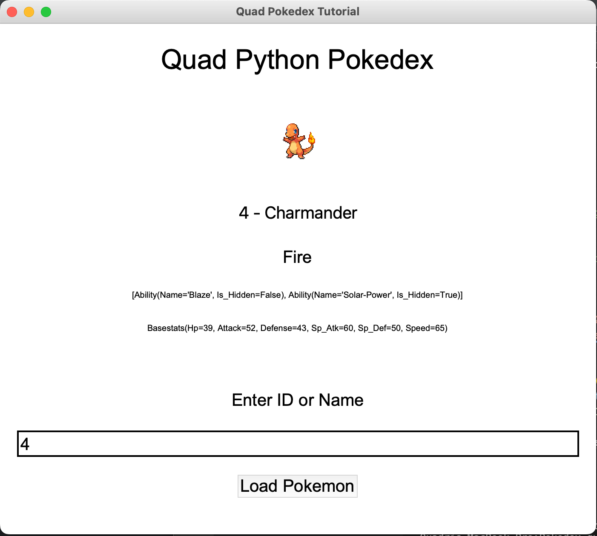

# Python Pokedex

This is a application built using Python 3.8 which works by utillizing the PyPokedex is a minimal Pokedex library for Python that uses PokeAPI internally to get Pokemon data. All Kanto, Johto and even more Pokemon are available from this Pokedex.

## Prequistes 

The Following Modules are used in this application 

```python

pip3 install Tkinter 

pip3 install PIL 

pip3 install pypokedex 

pip3 install urllib3 

pip3 install io

```
IO  -  Allows us to manage the file-related input and output operation 


Tkinter - Which is the Module we will utillise to create the GUI used in this application 

PIL - PIL stands for Python Imaging Library, and it's the original library that enabled Python to deal with images.

PIL.ImageTk - contains support to create and modify Tkinter BitmapImage and PhotoImage objects from PIL images

urllib3 -  a powerful, sanity-friendly HTTP client for Python. It supports thread safety, connection pooling, client-side SSL/TLS verification, file uploads with multipart encoding, helpers for retrying requests and dealing with HTTP redirects, gzip and deflate encoding, and proxy for HTTP and SOCKS

PyPokedex - This is the Pokedex Library we will be importing that uses the PokeAPI internally so that we can utillise this data locally.

This code was also created with Python 3.8

## Demo 

